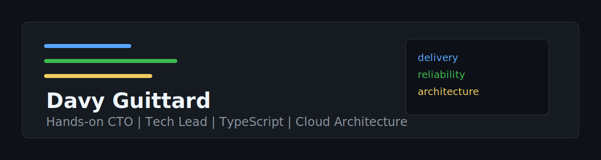

# Hands-on CTO | Tech Lead | AI, Automation, TypeScript & Cloud Architecture

Based in Lyon, France. Main profile: [LinkedIn](https://www.linkedin.com/in/davy-guittard/).

Freelance focus: AI, automation, TypeScript, and SaaS missions up to 4 months where a team needs someone who can understand the product, ship code, streamline workflows, stabilize delivery, and leave better engineering habits behind.

AI/TypeScript/SaaS mission up to 4 months: contact me on [LinkedIn](https://www.linkedin.com/in/davy-guittard/) or by [email](mailto:davyguittard@gmail.com). Objective: unblock, automate, ship, stabilize, and transfer ownership.

Mission IA/TypeScript/SaaS jusqu'a 4 mois: contactez-moi sur [LinkedIn](https://www.linkedin.com/in/davy-guittard/) ou par [email](mailto:davyguittard@gmail.com). Objectif: debloquer, automatiser, livrer, stabiliser, transmettre.

## EN

I help SaaS companies, startups, and product teams move faster without letting quality, architecture, or production reliability drift.
My work sits between hands-on fullstack development, cloud architecture, DevOps, and engineering leadership.

I have 10+ years of experience across JavaScript/TypeScript, React, Next.js, Node.js, NestJS,
cloud-native platforms, and engineering team growth.

### Best Fit Missions

The goal is simple: unblock the team, automate friction, ship useful changes, reduce operational risk, and leave clear ownership behind.

- `Fullstack or AI-assisted intervention` - a few days to 2 months to unblock a feature, API, frontend flow, production issue, or delivery bottleneck.
- `Technical and workflow audit` - a few days to 1 month to assess architecture, code quality, CI/CD, cloud setup, reliability, team workflow risks, and automation opportunities.
- `AI and process automation mission` - 2 weeks to 4 months to frame, prototype, or industrialize pragmatic AI features, internal assistants, automation tools, and productivity workflows.
- `Architecture and delivery mission` - 1 to 4 months to implement focused improvements on TypeScript, SaaS, API, CI/CD, observability, and cloud stacks.
- `Engineering quality enablement` - 1 to 4 months to train a team through practical process changes, pairing, review standards, test strategy, and CI quality gates.
- `Hands-on CTO support` - temporary or part-time support up to 4 months to align product roadmap, engineering capacity, technical strategy, OKRs, onboarding, and delivery quality.

### Expected Deliverables

- Merged PRs, reviewed implementation notes, and deployment or handover documentation.
- Architecture/risk map with a prioritized backlog and clear tradeoffs.
- AI opportunity map, prototype scope, prompt/workflow design notes, evaluation criteria, and integration risk assessment.
- Automation inventory and shipped productivity tools for repetitive workflows, internal operations, support, delivery, reporting, or knowledge work.
- CI/CD fixes, quality gates, test strategy, observability/SLO recommendations, and production-readiness checks.
- Team-facing playbooks: PR checklist, Definition of Done, review standards, testing conventions, and incident/postmortem templates.

### Proven Operating Contexts

- Defined technical vision for a 2M+ user SaaS community platform.
- Doubled delivery speed with React, Next.js, Supabase, Prisma, and Vercel delivery workflows.
- Reduced production incidents by 75% through CI/CD automation, SLOs, and monitoring practices.
- Rebuilt SaaS platforms on cloud-native stacks with Angular, NestJS, MongoDB, Azure, and Terraform.
- Delivered an AWS Serverless MVP in 2 months with Node.js, DynamoDB, S3, and Lambda.
- Raised test coverage to 85% while modernizing a regulated financial SaaS.
- Built 50 Codex plugins to automate repeatable workflows, formalize delivery processes, and create productivity tooling around AI-assisted work.

### AI, Automation And Productivity Tooling

I help teams use AI and automation where they create practical leverage, not as a buzzword. My focus is the engineering layer around AI products, internal tools, workflow automation, and AI-assisted delivery:

- Frame AI opportunities against real product workflows, data constraints, cost, latency, privacy, and operational risk.
- Prototype LLM-powered features, internal assistants, workflow automation, convenience tools, and agent-like flows with clear acceptance criteria.
- Design prompt/workflow contracts, evaluation criteria, fallback behavior, observability, and human-in-the-loop review.
- Integrate AI capabilities into existing TypeScript/SaaS stacks without bypassing security, tests, CI/CD, or maintainability.
- Improve productivity across engineering, product, operations, support, and knowledge workflows with small tools that reduce friction and repetitive work.
- Build Codex plugins, scripts, templates, and workflow assistants that encode process, reduce manual coordination, and keep ownership explicit.

### Engineering Quality Intervention

For CTOs who want to improve delivery discipline without slowing the team down, I focus on practical process changes that developers can actually adopt:

- Map the current delivery flow from issue intake to production.
- Identify quality risks in code review, tests, CI/CD, observability, and release ownership.
- Define lightweight standards for PRs, testing, Definition of Done, incidents, and production readiness.
- Pair with developers on real tickets so the process is learned through delivery, not slides.
- Leave reusable checklists and conventions that the team can keep using after the mission.

Typical first-month format:

- `Week 1`: audit the repo, CI/CD, review flow, test coverage, release process, and production risks.
- `Week 2`: pair with developers on real tickets while introducing PR standards, test conventions, and CI quality gates.
- `Week 3`: introduce automation, internal tools, or AI-assisted workflows where they remove concrete team friction.
- `Week 4`: stabilize the process, document the playbook, review adoption with the team, and hand over a prioritized improvement backlog.

### Selected Private-Work Case Studies

Most recent production work was delivered inside private company or client repositories. The cases below summarize CV-backed outcomes without exposing proprietary code.

1. `Ed.Ai` - Founding Engineer in an AI product context. Helped shape engineering strategy, coding standards, SDLC practices, and product specifications with cross-functional teams.
2. `Legendary Plays` - CTO Hands-on for a 2M+ user SaaS community platform. Defined technical vision, scaled React/Next.js/Supabase/Prisma/Vercel workflows, structured OKRs and onboarding, partnered with product on roadmap/capacity, doubled delivery speed, and reduced production incidents by 75% through CI/CD, SLOs, and monitoring.
3. `Charvet Digital Media / IBIZA Software` - Tech Lead on SaaS modernization and quality practices. Rebuilt cloud-native systems with Angular, NestJS, MongoDB, Azure, and Terraform; introduced agile delivery, CI/CD, and test automation; recruited and mentored developers; raised test coverage to 85% in a regulated financial SaaS context.
4. `Smash / Contentsquare` - Senior delivery on cloud and product engineering. Designed and shipped an AWS Serverless MVP in 2 months with Node.js, DynamoDB, S3, and Lambda; then built TypeScript microservices, modular Vue.js frontends, AWS Lambda/SQS services, and contributed to distributed-system architecture reviews.

### Core Stack

- `Frontend`: React, Next.js, Vue.js, Angular
- `Backend`: Node.js, NestJS, TypeScript, REST APIs
- `Data`: PostgreSQL, MongoDB, DynamoDB, Prisma, Supabase
- `AI and automation`: LLM workflows, prompt/workflow contracts, Codex plugins, AI-assisted delivery, agent-like automation, evaluation criteria
- `Cloud and DevOps`: AWS, Azure, GCP, Kubernetes, Terraform, Vercel, CI/CD
- `Engineering leadership`: recruitment, mentoring, 1:1s, performance reviews, OKRs, agile delivery

### Private Work And Interview Evidence

Most recent CTO/Tech Lead delivery happened in private employer or client repositories, so public GitHub is not a useful representation of my production work.
I can discuss architecture decisions, anonymized code/process patterns, and concrete tradeoffs during an interview or under NDA.
What I can show or walk through: anonymized architecture diagrams, PR/review checklists, test strategy excerpts, ADR examples, delivery-risk maps, and process playbooks.

### How I Work In Your Team

- I join existing rituals and tooling instead of forcing a process reset on day one.
- I make product scope, technical risks, and engineering capacity visible.
- I ship code, review code, mentor developers, and document decisions.
- I treat CI/CD, tests, observability, SLOs, and incident reduction as product enablers.
- I keep limits explicit and decisions traceable.

### Availability And Working Terms

- Remote-first from Lyon, France; hybrid or onsite in France depending on mission context.
- French native, English fluent.
- Best fit: freelance missions up to 4 months, part-time hands-on CTO support, AI/process automation, team enablement, and focused delivery sprints.
- Current availability and commercial terms are confirmed directly by LinkedIn or email.

### Contact

- GitHub: [@ty000](https://github.com/ty000)
- LinkedIn: [Davy Guittard](https://www.linkedin.com/in/davy-guittard/)
- Email: [davyguittard@gmail.com](mailto:davyguittard@gmail.com)

### Credibility Limits

- No legal, tax, or compliance certification service.
- No unconditional SLA, incident reduction, or performance guarantee without an explicit operating agreement.
- Project examples are implementation snapshots, not universal outcome guarantees.

## FR

J'aide les equipes SaaS, startups et produits a avancer plus vite sans laisser deriver la qualite, l'architecture ou la fiabilite de production.
Mon travail se situe entre developpement fullstack hands-on, architecture cloud, DevOps et leadership technique.

J'ai 10+ ans d'experience sur JavaScript/TypeScript, React, Next.js, Node.js, NestJS,
les plateformes cloud-native et le developpement d'equipes engineering.

### Missions Ou Je Suis Le Plus Utile

L'objectif est simple: debloquer l'equipe, automatiser les frictions, livrer des changements utiles, reduire le risque operationnel et transmettre clairement la suite.

- `Intervention fullstack ou augmentee IA` - quelques jours a 2 mois pour debloquer une feature, une API, un parcours frontend, un probleme de production ou un blocage de delivery.
- `Audit technique et workflow` - quelques jours a 1 mois pour evaluer architecture, qualite de code, CI/CD, cloud, fiabilite, risques de workflow equipe et opportunites d'automatisation.
- `Mission IA et automatisation de process` - 2 semaines a 4 mois pour cadrer, prototyper ou industrialiser des features IA pragmatiques, assistants internes, outils d'automatisation et workflows de productivite.
- `Mission architecture et delivery` - 1 a 4 mois pour implementer des ameliorations ciblees sur TypeScript, SaaS, API, CI/CD, observabilite et cloud.
- `Formation process qualite dev` - 1 a 4 mois pour faire progresser l'equipe via pairing, standards de review, strategie de tests et quality gates CI.
- `Support CTO hands-on` - support temporaire ou part-time jusqu'a 4 mois pour aligner roadmap produit, capacite engineering, strategie technique, OKRs, onboarding et qualite de livraison.

### Livrables Attendus

- PRs mergees, notes d'implementation relues, documentation de deploiement ou de passation.
- Cartographie architecture/risques avec backlog priorise et arbitrages explicites.
- Cartographie d'opportunites IA, scope de prototype, notes de design prompt/workflow, criteres d'evaluation et analyse des risques d'integration.
- Inventaire d'automatisation et outils de productivite livres pour workflows repetitifs, operations internes, support, delivery, reporting ou knowledge work.
- Corrections CI/CD, quality gates, strategie de tests, recommandations observabilite/SLOs et checks de readiness production.
- Playbooks equipe: checklist PR, Definition of Done, standards de review, conventions de tests et templates incident/postmortem.

### Contextes Operationnels Prouves

- Definition de la vision technique d'une plateforme SaaS communautaire de 2M+ utilisateurs.
- Doublement de la vitesse de delivery avec React, Next.js, Supabase, Prisma et Vercel.
- Reduction des incidents de production de 75% via automatisation CI/CD, SLOs et monitoring.
- Refonte de plateformes SaaS vers des stacks cloud-native avec Angular, NestJS, MongoDB, Azure et Terraform.
- Livraison d'un MVP AWS Serverless en 2 mois avec Node.js, DynamoDB, S3 et Lambda.
- Passage de la couverture de tests a 85% pendant la modernisation d'un SaaS financier reglemente.
- Developpement de 50 plugins Codex pour automatiser des workflows repetables, formaliser des process de delivery et creer de l'outillage de productivite autour du travail assiste par IA.

### IA, Automatisation Et Outillage De Productivite

J'aide les equipes a utiliser l'IA et l'automatisation la ou elles creent un levier concret, pas comme un mot-cle. Mon focus est la couche engineering autour des produits IA, outils internes, automatisations de workflows et delivery augmente par l'IA:

- Cadrer les opportunites IA face aux workflows produit reels, contraintes data, couts, latence, privacy et risque operationnel.
- Prototyper des features LLM, assistants internes, automatisations de workflow, outils de confort et flows proches d'agents avec criteres d'acceptation clairs.
- Concevoir des contrats prompt/workflow, criteres d'evaluation, comportements fallback, observabilite et validation human-in-the-loop.
- Integrer des capacites IA dans des stacks TypeScript/SaaS existantes sans contourner securite, tests, CI/CD ou maintenabilite.
- Ameliorer la productivite engineering, produit, operations, support et knowledge work avec de petits outils qui reduisent les frictions et le travail repetitif.
- Construire plugins Codex, scripts, templates et assistants de workflow qui encodent le process, reduisent la coordination manuelle et gardent l'ownership explicite.

### Intervention Process Qualite Dev

Pour un CTO qui veut faire progresser ses pratiques sans ralentir l'equipe, je travaille sur des changements concrets que les developpeurs peuvent adopter:

- Cartographier le flux actuel, du ticket jusqu'a la production.
- Identifier les risques dans la review, les tests, la CI/CD, l'observabilite et la responsabilite de release.
- Definir des standards legers pour les PRs, les tests, la Definition of Done, les incidents et la readiness production.
- Faire du pairing avec les developpeurs sur de vrais tickets pour ancrer les pratiques dans le delivery.
- Laisser des checklists et conventions reutilisables apres la mission.

Format type premier mois:

- `Semaine 1`: audit du repo, de la CI/CD, du flux de review, des tests, du process de release et des risques production.
- `Semaine 2`: pairing avec les developpeurs sur de vrais tickets, avec introduction des standards PR, conventions de tests et quality gates CI.
- `Semaine 3`: introduction d'automatisations, outils internes ou workflows assistes par IA la ou ils suppriment des frictions concretes.
- `Semaine 4`: stabilisation du process, documentation du playbook, revue d'adoption avec l'equipe et passation d'un backlog d'amelioration priorise.

### Cas Clients / Projets Anonymises

La majorite du travail de production recent se trouve dans des repos prives d'entreprises ou de clients. Les cas ci-dessous resument des resultats issus du CV sans exposer de code proprietaire.

1. `Ed.Ai` - Founding Engineer dans un contexte produit IA. Contribution a la strategie engineering, aux standards de code, aux pratiques SDLC et aux specifications produit avec des equipes cross-fonctionnelles.
2. `Legendary Plays` - CTO Hands-on sur une plateforme SaaS communautaire de 2M+ utilisateurs. Vision technique, scaling React/Next.js/Supabase/Prisma/Vercel, structuration des OKRs et de l'onboarding, alignement roadmap/capacite avec le produit, doublement de la vitesse de delivery et reduction des incidents de production de 75% via CI/CD, SLOs et monitoring.
3. `Charvet Digital Media / IBIZA Software` - Tech Lead sur modernisation SaaS et pratiques qualite. Refonte cloud-native avec Angular, NestJS, MongoDB, Azure et Terraform; mise en place delivery agile, CI/CD et automatisation de tests; recrutement et mentoring de developpeurs; couverture de tests portee a 85% dans un contexte SaaS financier reglemente.
4. `Smash / Contentsquare` - Delivery senior sur cloud et engineering produit. Design et livraison d'un MVP AWS Serverless en 2 mois avec Node.js, DynamoDB, S3 et Lambda; puis microservices TypeScript, frontends Vue.js modulaires, services AWS Lambda/SQS et contribution aux reviews d'architecture distribuee.

### Stack Principale

- `Frontend`: React, Next.js, Vue.js, Angular
- `Backend`: Node.js, NestJS, TypeScript, APIs REST
- `Data`: PostgreSQL, MongoDB, DynamoDB, Prisma, Supabase
- `IA et automatisation`: workflows LLM, contrats prompt/workflow, plugins Codex, delivery augmente par l'IA, automatisation type agent, criteres d'evaluation
- `Cloud et DevOps`: AWS, Azure, GCP, Kubernetes, Terraform, Vercel, CI/CD
- `Leadership engineering`: recrutement, mentoring, 1:1s, performance reviews, OKRs, delivery agile

### Travail Prive Et Preuves En Entretien

La majorite du delivery CTO/Tech Lead recent a ete realisee dans des repos prives d'employeurs ou de clients: le GitHub public n'est donc pas une representation utile de mon travail de production.
Je peux discuter des decisions d'architecture, patterns de code/process anonymises et arbitrages concrets en entretien ou sous NDA.
Ce que je peux montrer ou parcourir: schemas d'architecture anonymises, checklists PR/review, extraits de strategie de tests, exemples d'ADR, cartographies de risque delivery et playbooks process.

### Comment Je Travaille Dans Une Equipe

- Je rejoins les rituels et outils existants avant d'imposer un nouveau process.
- Je rends visibles le scope produit, les risques techniques et la capacite engineering.
- Je livre du code, review du code, mentore les developpeurs et documente les decisions.
- Je traite CI/CD, tests, observabilite, SLOs et reduction d'incidents comme des leviers produit.
- Je garde les limites explicites et les decisions tracables.

### Disponibilite Et Modalites

- Remote-first depuis Lyon, France; hybride ou onsite en France selon le contexte de mission.
- Francais natif, anglais courant.
- Meilleur fit: missions freelance jusqu'a 4 mois, support CTO hands-on part-time, automatisation IA/process, formation d'equipe et sprints de delivery cibles.
- Disponibilite actuelle et conditions commerciales a confirmer directement par LinkedIn ou email.

### Contact

- GitHub: [@ty000](https://github.com/ty000)
- LinkedIn: [Davy Guittard](https://www.linkedin.com/in/davy-guittard/)
- Email: [davyguittard@gmail.com](mailto:davyguittard@gmail.com)

### Limites De Credibilite

- Pas de service de certification legale, fiscale ou compliance.
- Pas de garantie inconditionnelle de SLA, reduction d'incident ou performance sans accord operationnel explicite.
- Les exemples projets sont des instantanes d'implementation, pas des garanties de resultat universel.
