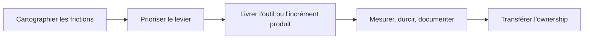

# Freelance Tech Lead | AI Automation & Product Delivery

Interventions freelance jusqu'à 4 mois pour équipes SaaS, produit et opérations : automatisation de process, outillage interne, workflows IA, delivery produit et qualité engineering.

Contact : [LinkedIn](https://www.linkedin.com/in/davy-guittard/) ou [email](mailto:davyguittard@gmail.com).

## Types d'intervention

| Mission | Contexte | Livrables |
| --- | --- | --- |
| `IA & automatisation de process` | Process répétitifs, support lourd, reporting manuel, workflows internes dispersés | Outils internes, assistants IA, scripts/plugins, workflow documenté, critères d'évaluation |
| `Delivery produit` | Feature bloquée, MVP, API/frontend à livrer, dette qui freine le produit | PRs mergées, arbitrages techniques, documentation de passation, plan de suite |
| `Qualité dev & delivery` | Reviews faibles, tests insuffisants, CI/CD fragile, onboarding difficile | Standards PR, Definition of Done, quality gates, stratégie de tests, playbook équipe |
| `Leadership technique hands-on` | Besoin temporaire de cadrage CTO/Tech Lead sans perdre l'exécution | Roadmap/capacité, architecture, mentoring, rituels delivery, risques visibles |

## Méthode

## Repères

| Contexte | Intervention | Signal |
| --- | --- | --- |
| `Codex tooling` | Développement de 50 plugins pour automatiser des workflows répétables et formaliser des process de delivery | Outillage IA/process concret |
| `Ed.Ai` | Founding Engineer dans un contexte produit IA | Stratégie engineering, standards de code, SDLC, specs produit |
| `Legendary Plays` | CTO hands-on sur plateforme SaaS communautaire 2M+ utilisateurs | Vitesse de delivery doublée, incidents prod -75%, React/Next.js/Supabase/Prisma/Vercel |
| `Charvet / IBIZA` | Modernisation SaaS, CI/CD, tests, mentoring | Couverture tests 85%, Angular/NestJS/MongoDB/Azure/Terraform |
| `Smash / Contentsquare` | MVP serverless puis microservices/frontends TypeScript | MVP AWS serverless en 2 mois, Lambda/SQS, Vue.js, architecture reviews |

## IA, automatisation et outillage interne

Champs d'intervention habituels :

- assistants internes et workflows LLM avec critères d'acceptation clairs ;
- scripts, plugins, templates et automatisations de coordination ;
- cartographie des opportunités IA avec coût, risque, data, privacy et latence ;
- contrats prompt/workflow, fallback behavior, évaluation et human-in-the-loop ;
- intégration dans des stacks existantes sans contourner tests, sécurité, CI/CD ou maintenabilité.

## Qualité dev par la pratique

Exemple de séquence sur le premier mois :

| Semaine | Focus |
| --- | --- |
| `1` | Audit repo, CI/CD, review flow, tests, release, risques production |
| `2` | Pairing sur vrais tickets, standards PR, conventions de tests, quality gates |
| `3` | Automatisations, outils internes ou workflows IA qui suppriment une friction concrète |
| `4` | Stabilisation, documentation, revue d'adoption, backlog d'amélioration priorisé |

## Stack et modalités

Stack principale

- `Frontend`: React, Next.js, Vue.js, Angular
- `Backend`: Node.js, NestJS, TypeScript, APIs REST
- `Data`: PostgreSQL, MongoDB, DynamoDB, Prisma, Supabase
- `IA et automatisation`: workflows LLM, contrats prompt/workflow, plugins Codex, delivery augmenté par l'IA, automatisation type agent, critères d'évaluation
- `Cloud et DevOps`: AWS, Azure, GCP, Kubernetes, Terraform, Vercel, CI/CD
- `Leadership engineering`: recrutement, mentoring, 1:1s, performance reviews, OKRs, delivery agile

- Remote-first depuis Lyon, France ; hybride ou onsite en France selon le contexte.
- Français natif, anglais courant.
- Missions freelance jusqu'à 4 mois, part-time hands-on lead, automatisation IA/process, product delivery et formation d'équipe.

## Preuves en entretien

La majorité du travail de production récent est dans des repos privés. Je peux parcourir en entretien ou sous NDA des schémas d'architecture anonymisés, checklists PR/review, extraits de stratégie de tests, exemples d'ADR, cartographies de risque delivery et playbooks process.

## English Summary

Freelance Tech Lead focused on AI automation and product delivery. I help SaaS, product and operations teams automate friction, ship reliable increments, improve engineering quality and transfer ownership. Best fit: AI/process automation, internal tools, TypeScript/SaaS delivery, engineering quality enablement and hands-on technical leadership for missions up to 4 months.

## Contact

- GitHub: [@ty000](https://github.com/ty000)
- LinkedIn: [Davy Guittard](https://www.linkedin.com/in/davy-guittard/)
- Email: [davyguittard@gmail.com](mailto:davyguittard@gmail.com)

## Limites de crédibilité

- Pas de service de certification légale, fiscale ou compliance.
- Pas de garantie inconditionnelle de SLA, réduction d'incident ou performance sans accord opérationnel explicite.
- Les exemples projets sont des instantanés d'implémentation, pas des garanties de résultat universel.
